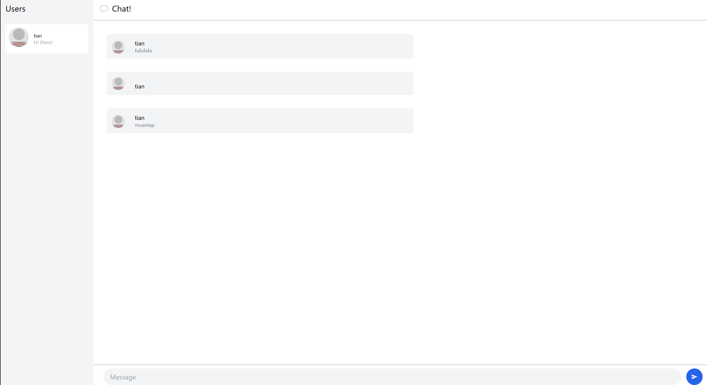
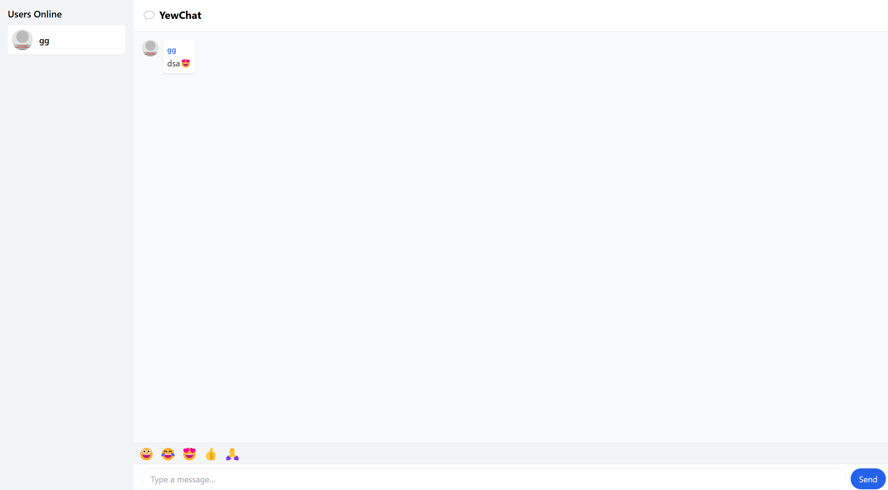

# YewChat

YewChat adalah aplikasi chat real-time yang dibangun dengan Rust dan framework Yew.  
Di bawah ini adalah sekilas tampilan dan fitur yang ada pada YewChat:

---

## Gambar 1: Login Page  

  
Halaman login YewChat hadir dengan desain minimalis namun modern, menggunakan background gelap dan form putih yang terpusat.  
- **Input Username:** Pengguna mengisi nama panggilan (username) di kolom berukuran lebar, dengan placeholder “Username” berwarna abu-abu lembut.  
- **Tombol “GO CHATTING!”:** Warna ungu mencolok agar mudah terlihat, dengan teks tebal berwarna putih. Setelah menekan tombol, aplikasi akan menyimpan username dan menavigasi ke halaman ruang chat.  
- **Responsif:** Layout otomatis menyesuaikan posisi form di tengah layar, baik pada desktop maupun perangkat mobile.

---

## Gambar 2: Tampilan Web Original  

  
Setelah login, pengguna diarahkan ke antarmuka utama chat:  
- **Sidebar Daftar Pengguna:** Terletak di sisi kiri, memuat avatar dan nama semua pengguna yang sedang online. Daftar ini dilengkapi scroll vertikal jika jumlah user banyak.  
- **Header Chat:** Bar di atas area pesan menampilkan judul “YewChat” dan info user yang sedang login (opsional).  
- **Area Pesan Utama:** Menampilkan riwayat pesan dalam urutan kronologis. Setiap pesan dilengkapi avatar pengirim, nama, dan isi pesan. Pesan GIF akan tampil sebagai gambar unggulan.  
- **Kotak Input & Tombol Kirim:** Terletak di bagian bawah, dilengkapi placeholder “Type a message…” dan tombol kirim biru. Mendukung pengiriman dengan klik tombol atau menekan tombol Enter di keyboard.

---

## Gambar 3: Fitur Emoji Picker  

  
Sebagai peningkatan interaktivitas, YewChat kini dilengkapi emoji picker:  
- **Bar Emoji:** Terpasang tepat di atas area input, menampilkan deretan emoji populer (😀 😂 😍 👍 🙏).  
- **Cara Pakai:** Klik salah satu ikon emoji akan otomatis menambahkan karakter emoji ke dalam bidang teks input tanpa menghapus teks yang sudah ada.  
- **Implementasi:** Menggunakan `NodeRef` untuk men-access elemen input, lalu memodifikasi `value()`-nya saat callback klik dijalankan. Pesan selanjutnya terkirim bersamaan emoji yang dipilih.  
- **Keuntungan:** Memudahkan pengguna mengekspresikan perasaan secara cepat, tanpa perlu menyalin manual atau mengingat kode emoji.

---